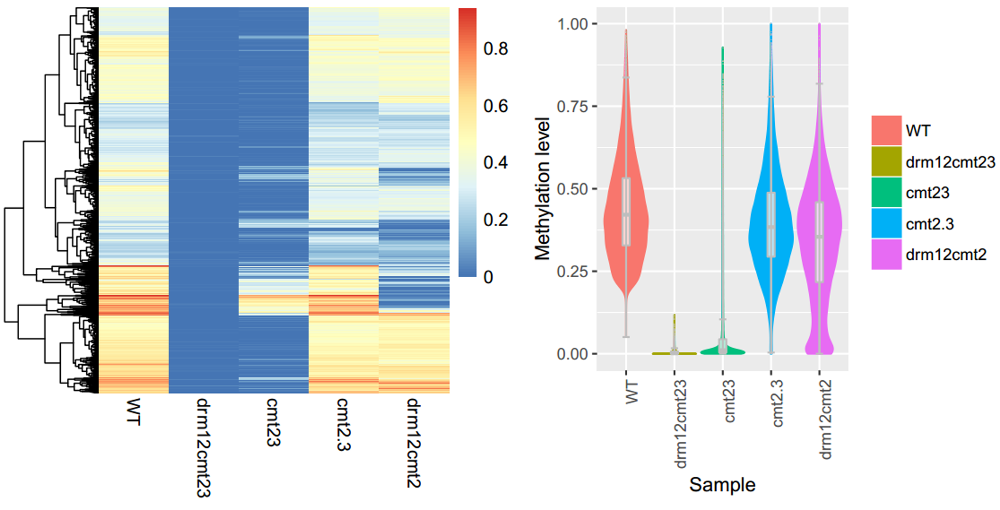
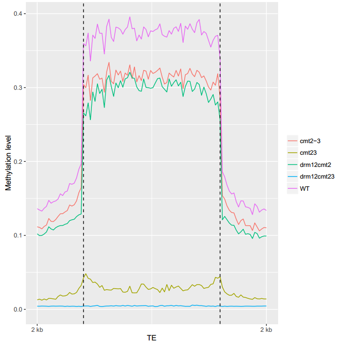
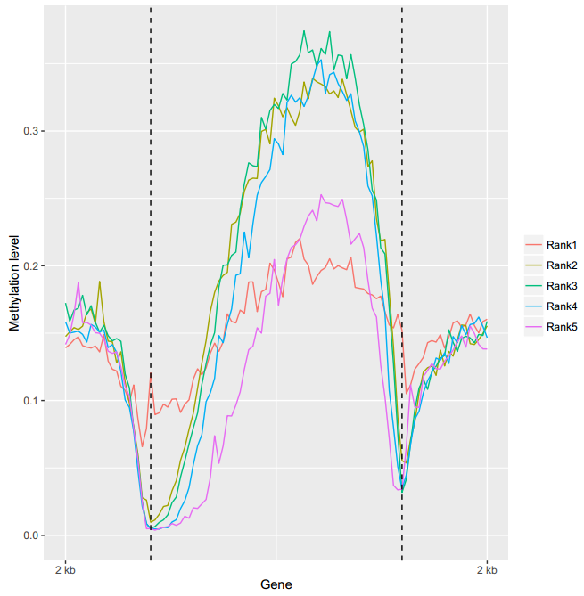
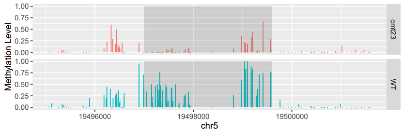

* [ViewBS](#viewbs)
  * [Workflow of ViewBS <a name="user\-content\-workflow"></a>](#workflow-of-viewbs-)
  * [Installation <a name="user\-content\-install"></a>](#installation-)
    * [Download the lastest version:](#download-the-lastest-version)
  * [Preparation of input files <a name="user\-content\-input"></a>](#preparation-of-input-files-)
  * [USAGE <a name="user\-content\-usage"></a>](#usage-)
    * [Download test data](#download-test-data)
    * [Top commands of ViewBS](#top-commands-of-viewbs)
      * [Top command: MethCoverage](#top-command-methcoverage)
      * [Top command: BisNonConvRate](#top-command-bisnonconvrate)
      * [GlobalMethLev](#globalmethlev)
      * [MethLevDist](#methlevdist)
      * [MethGeno](#methgeno)
      * [View MethHeatmap](#view-methheatmap)
      * [MethOverRegion](#methoverregion)
      * [MethOneRegion](#methoneregion)
    * [How to merge figures into one graph](#how-to-merge-figures-into-one-graph)
      * [1\. Use the R script in ViewBS to do so:](#1-use-the-r-script-in-viewbs-to-do-so)
      * [2\. Use the template below to merge multiple figures into one graph\.](#2-use-the-template-below-to-merge-multiple-figures-into-one-graph)
  * [Where to find help <a name="user\-content\-help"></a>](#where-to-find-help-)
  * [Commercial use](#commercial-use)
  * [How to cite <a name="user\-content\-cite"></a>](#how-to-cite-)
  * [Authors](#authors)

# ViewBS

1. [Workflow of ViewBS](#workflow)
2. [Installation](#install)
3. [Preparation of input files](#input)
4. [Usage](#usage)
5. [Where to find help](#help)
6. [How to cite](#cite)

## Workflow of ViewBS <a name="workflow"></a>

ViewBS has several top level commands which determine the required and optimal arguments. These top level commands can be divided into two parts: methylation report and data visualization of functional regions.

Methylation report part has several different top commands which can generate report about read coverage, distribution of methylation level, global methylation leve, etc.

The part of visualization for functional regions also has several different top commands. For ViewBS, the first input that users should provide is the regions of interest. These regions could be functional elements, like genes, transposable elements (TE), or differentially methylated regions (DMR). The other type of input that the users should provide is the methylation information. Methylation information are the outputs from BS-seq aligner, like Bismark, etc.

Here is the workflow of ViewBS:

<p align="center">
  
  <b>The workflow of ViewBS commands</b><br>
</p>


## Installation <a name="install"></a>

> To make the installation of dependencies easier, a script was developped. `perl INSTALL.pl
` can be used as a helper to install and check the dependencies.

### Download the lastest version:

```
https://github.com/xie186/ViewBS/releases/latest
```

1. Install [htslib](https://github.com/samtools/htslib)
2. Perl version: >= 5.14.4
3. Perl packages:
   * Getopt::Long::Subcommand - Process command-line options, with subcommands and completion
   * Bio::DB::HTS::Tabix - Object oriented access to the underlying tbx C methods
   * Bio::SeqIO - Handler for SeqIO Formats
    ```
    wget https://raw.githubusercontent.com/xie186/ViewBS/master/ext_tools/cpanm
    chmod 755 cpanm
    cpanm --local-lib=~/perl5 local::lib && eval $(perl -I ~/perl5/lib/perl5/ -Mlocal::lib)
    ./cpanm Getopt::Long::Subcommand
    ./cpanm Bio::DB::HTS::Tabix 
    ./cpanm Bio::SeqIO
    ```
4. R version: > 3.3.0
5. R packages
    * ggplot2
    * pheatmap
    * reshape2
    * cowplot

    Install the required libraries in R:
    ```
    install.packages("ggplot2", dep=T)
    install.packages("cowplot", dep=T)
    install.packages("pheatmap", dep=T)
    install.packages("reshape2", dep=T)
    ```

## Preparation of input files <a name="input"></a>

* Input file: __Genome-wide cytosine methylation report__

ViewBS uses __Genome-wide cytosine methylation report__ as input file. It is sorted by chromosomal coordinates but also contains the sequence context and is in the following format:
```
<chromosome> <position> <strand> <count methylated> <count unmethylated> <C-context> <trinucleotide context>
```
> NOTES: If you use other tools rather than Bismark to generate the methylation information, you can still use ViewBS. We already include the scripts to convert the results of other tools (BSseeker and Brat) https://github.com/xie186/ViewBS/tree/master/lib/scripts to __Genome-wide cytosine methylation report__ format. If the script for your tool is not included, please feel free to contact us at xie186@purdue.edu 

Please see details in [Bismark](http://www.bioinformatics.babraham.ac.uk/projects/bismark/) websites.

> *Tips: how to generate __Genome-wide Cytosine Methylation Report__*

> If you already have finished the mapping using Bismark, you should have a sam/bam file. Let's say you have a sam file named *test.sam*. What you can do to generate __Genome-wide Cytosine Methylation Report__ is:

> ```
> ### This step will generate several files:
> bismark_methylation_extractor --bedGraph --CX test.sam
> ### This step will generate a file named bis_test.tab
> coverage2cytosine -CX -o test.bis_rep.cov --genome_folder ara/ test.bismark.cov
> ```
*For BS-seq that is processed by Bismark but by other tools like [BRAT](http://compbio.cs.ucr.edu/brat/), [BS seeker2](https://github.com/BSSeeker/BSseeker2), ViewBS provides supports to convert DNA methylation data in other format to the format of genome-wide cytosine methylation report. Supports for other tools will be developed upon requests from the users. If you have DNA methylation data generated by other tools and you have difficulties on converting the data format, just give a post in the [issuse](https://github.com/readbio/ViewBS/issues). We're happy to add new functions for the file format conversion. *

For details, please see the link below:
https://github.com/xie186/ViewBS/wiki/Support-for-nonBismark-results

* Tabix indexing 

Since ViewBS uses Bio::DB::HTS::Tabix to quickly retrieves information from the input (TAB-delited) files, the __Genome-wide Cytosine Methylation Report__ files should be *bgzip*ped and *tabix* indexed. *bgzip* and *tabix* . 

*Note: tabix and bgzip binaries are now part of the HTSlib project. https://github.com/samtools/htslib*

Here is an example:

```
bgzip test.bis_rep.cov            ## test.bis_rep.cov.gz will be generated. Note: test.bis_rep.cov shoud be sorted based on chromosome coordinates.
tabix -p vcf test.bis_rep.cov.gz  ## test.bis_rep.cov.gz.tbi will be generated. Now test.bis_rep.cov.gz can be used as input for ViewBS. 
```

## USAGE <a name="usage"></a>

### Download test data

https://gitlab.com/BS-seq/ViewBS_testdata

### Top commands of ViewBS 

#### Top command: MethCoverage

<p align="center">
  
</p>
<p align="center">
  <b>An Example of Coverage Distribution of BS-seq</b><br>
</p>

To generate the figure above, use the command shown as below:
```
ViewBS MethCoverage --reference TAIR10_chr_all.fasta --sample bis_WT.tab.gz,WT --sample bis_cmt23.tab.gz,cmt23 --sample bis_cmt2-3.tab.gz,cmt2-3 --sample bis_drm12cmt23.tab.gz,drm12cmt12 --sample bis_drm12cmt2.tab.gz,drm12cmt2 --outdir methCoverage --prefix cmt2_proj_allsam
```
Under *methCoverage* folder, there will be three files generated.

* Table for global methylation level.

| Sample 	| Context  	| Depth 	| Percentage       	|
|--------	|----------	|-------	|------------------	|
| cmt2-3 	| CG       	| 1     	| 93.3323115145888 	|
| cmt2-3 	| CG       	| 2     	| 91.6474703919394 	|
| ...    	| ...      	| ...   	| ...              	|
| ...    	| ...      	| ...   	| ...              	|
| WT     	| CG       	| 1     	| 93.8364493009668 	|

* A shell script which can re-generate the figure in PDF file.
* A figure in PDF file.

#### Top command: BisNonConvRate

<p align="center">
  
</p>
<p align="center">
  <b>An Example of BisNonConvRate</b><br>
</p>

To generate the figure above, use the command shown as below:
```
ViewBS BisNonConvRate --chrom chrC --sample bis_WT.tab.gz,WT --sample bis_cmt23.tab.gz,cmt23 --sample bis_cmt2-3.tab.gz,cmt2-3 --sample bis_drm12cmt2.tab.gz,drm12cmt2 --sample bis_drm12cmt23.tab.gz,drm12cmt23 --outdir BisNonConvRate --prefix cmt2_proj_allsam
```
Under *BisNonConvRate*, there will be three files generated.

* Table for global methylation level.

| Sample     | BisNonConvRate |
|------------|----------------|
| cmt2-3     | 0.053          |
| drm12cmt2  | 0.048          |
| drm12cmt12 | 0.040          |
| cmt23      | 0.046          |
| WT         | 0.075          |

* A shell script which can re-generate the figure in PDF file.
* A figure in PDF file.

#### GlobalMethLev

<p align="center">
  
</p>
<p align="center">
  <b>An Example of GlobalMethLev</b><br>
</p>

To generate the figure above, use the command shown as below:
```
ViewBS GlobalMethLev --sample bis_WT.tab.gz,WT --sample bis_cmt23.tab.gz,cmt23 --sample bis_cmt2-3.tab.gz,cmt2-3 --sample bis_drm12cmt2.tab.gz,drm12cmt2 --sample bis_drm12cmt23.tab.gz,drm12cmt23 --outdir methGlobal --prefix cmt2_proj_allsam
```
Under *methGlobal*, there will be three files generated.

* Table for global methylation level.

| Sample     	| CG    	| CHG   	| CHH   	|
|------------	|-------	|-------	|-------	|
| cmt2-3     	| 0.227 	| 0.062 	| 0.010 	|
| drm12cmt2  	| 0.220 	| 0.058 	| 0.005 	|
| cmt23      	| 0.224 	| 0.009 	| 0.011 	|
| drm12cmt23 	| 0.219 	| 0.004 	| 0.005 	|
| WT         	| 0.245 	| 0.079 	| 0.029 	|

* A shell script which can re-generate the figure in PDF file.
* A figure in PDF file. 

#### MethLevDist

<p align="center">
  
</p>
<p align="center">
  <b>An Example of MethLevDist</b><br>
</p>

To generate the figure above, use the command shown as below:
```
ViewBS.pl MethLevDist --sample bis_WT.tab.gz,WT --sample bis_cmt23.tab.gz,cmt23 --sample bis_cmt2-3.tab.gz,cmt2-3 --sample bis_drm12cmt23.tab.gz,drm12cmt12 --sample bis_drm12cmt2.tab.gz,drm12cmt2 --outdir methLevDist --prefix cmt2_proj_allsam --binMethLev 0.1
```
* Table for numbers and percentages of sites in each methylation level bin.

| Sample 	| Context  	| MethLevBinMidPoint 	| Number   	| Percentage 	|
|--------	|----------	|------------------	|----------	|------------	|
| cmt2-3 	| CG       	| 0.05             	| 3305969  	| 12.83      	|
| cmt2-3 	| CG       	| 0.15             	| 62823    	| 0.24       	|
| cmt2-3 	| CG       	| 0.25             	| 25182    	| 0.09       	|
| ...    	| ...      	| ...              	| ...      	| ..         	|
| WT     	| CG       	| 0.05             	| 3470693  	| 13.73      	|

* A shell script which can re-generate the figure in PDF file.
* A figure in PDF file.

#### MethGeno

<p align="center">
  
</p>
<p align="center">
  <b>An example of MethGeno</b><br>
</p>

To generate the figure above, use the command shown as below:
```
ViewBS MethGeno --genomeLength TAIR10_chr_all.fasta.fai --sample bis_WT.tab.gz,WT --sample bis_cmt23.tab.gz,cmt23 --sample bis_cmt2-3.tab.gz,cmt2-3 --sample bis_drm12cmt2.tab.gz,drm12cmt2 --sample bis_drm12cmt23.tab.gz,drm12cmt23 --prefix bis_geno_sample --context CHH
```

_Note: fai file can generated by samtools: ```samtools faidx TAIR10_chr_all.fasta```_

#### View MethHeatmap

Region file format:
* 1st column: chromsome ID;
* 2nd column: start position;
* 3rd column: end position;
* 4th column: region ID

*Note: If the file has 4th column, each row in this column should be unique.* 

<p align="center">
  
</p>
<p align="center">
  <b>An example of MethHeatmap</b><br>
</p>

To generate the figure above, use the command shown as below:
```
ViewBS MethHeatmap --region CHG_hypo_DMR_drm12cmt23_to_WT.txt --sample bis_WT.tab.gz,WT --sample bis_drm12cmt23.tab.gz,drm12cmt23 --sample bis_cmt23.tab.gz,cmt23 --sample bis_cmt2-3.tab.gz,cmt2-3 --sample bis_drm12cmt2.tab.gz,drm12cmt2 --prefix CHG_hypo_DMR_drm12cmt23_to_WT --context CHG --outdir MethHeatmap
```

#### MethOverRegion

<p align="center">
  
</p>
<p align="center">
  <b>An example of MethOverregion</b><br>
</p>

```
ViewBS MethOverRegion --region TAIR10_Transposable_Elements.chr1.bed --sample bis_WT.tab.gz,WT --sample bis_cmt23.tab.gz,cmt23 --sample bis_cmt2-3.tab.gz,cmt2-3 --sample bis_drm12cmt2.tab.gz,drm12cmt2 --sample bis_drm12cmt23.tab.gz,drm12cmt23 --prefix bis_TE_chr1_sample --context CHG
```

Besides providing sample and region information in the commind line, you can also read the information from a TEXT file. For example, if you are interested in more than one group of genes and you want to study the differences of DNA methylation patterns in the one sample, the methylation information can also be read from a TEXT file. Instead of giving an explicit sample information pairs, you need to write "file:" followed by the name of the TEXT file. In this case, you can only use --sample once and you cann't use --region anymore. 

The TEXT file should follow the following format:

|#MethReportFile | LegendName  | RegionFile   |
|----------------|-------------|--------------|
| DNAmethylation | RegionName1 | Region_file2 |

Here is an example:

```
ViewBS MethOverRegion --sample file:sampl_info_tab.txt --prefix bis_gene_5rank --context CG --outdir MethOverRegion
```

The genes were devided into quintiles based on gene expression level. Rank1 group was the group with lowest expression level. Users can use this method to study the correlation between DNA methylation and gene expression. 

| #DNAmethylationData 	| Region 	| RegionFile                     	|
|---------------------	|--------	|--------------------------------	|
| bis_WT.tab.gz       	| Rank1  	| TAIR10_GFF3_genes.WT.rank1.tab 	|
| bis_WT.tab.gz       	| Rank2  	| TAIR10_GFF3_genes.WT.rank2.tab 	|
| bis_WT.tab.gz       	| Rank3  	| TAIR10_GFF3_genes.WT.rank3.tab 	|
| bis_WT.tab.gz       	| Rank4  	| TAIR10_GFF3_genes.WT.rank4.tab 	|
| bis_WT.tab.gz       	| Rank5  	| TAIR10_GFF3_genes.WT.rank5.tab 	|

Here is the figure generated by the command line above:



#### MethOneRegion

View MethOneRegion will output the methylation information for one region give by the users and then plot the methylation levels across the chromsomesome region. 

Here is an example:



To generate the figure above, you can use the following command line:

```
ViewBS MethOneRegion --region chr5:19499001-19499600 --sample bis_WT.tab.gz,WT --sample bis_cmt23.tab.gz,cmt23 --prefix chr5_19499001-19499600 --context CHG
```

### How to merge figures into one graph 

In ViewBS, all the figure objects will be saved into RDS files. The users can restore the RDS files and merge the figures into one graph. 

There are two ways to do this: 1) use the helper script named `mer_fig.R `; 2) the users can write R script to read the RDS files and merge the figures into one graph with [`cowplot`](https://cran.r-project.org/web/packages/cowplot/vignettes/introduction.html). 

#### 1. Use the R script in ViewBS to do so:

Example as below:

```
cd $PATH2testdata
Rscript ../../lib/scripts/mer_fig.R --input BisNonConvRate/cmt2_proj_allsam.tab.rds,MethGlobal/cmt2_proj_allsam.tab.rds,MethHeatmap/CHG_hypo_DMR_drm12cmt23_to_WT_MethHeatmap_CHG.pdf.rds --output testplot_col2.pdf --aspect_ratio 1.5 --ncol 2
```

Please see the following for the help information:

```
$ Rscript ../../lib/scripts/mer_fig.R -h

USAGE
    Usage: Rscript mer_fig.R --input <fig1.rds,fig2.rds> --labels <A,B,C,D> [options]

DESCRIPTION
    mer_fig.R is developed to merge figures into on graph.

Options
    -help | -h
            Prints the help message and exits.

    --input [required]
           - RDS files. <fig1.rds,fig2.rds...>

    --labels [optional]
           - Labesl for each figure. Default: <A,B,C,D...>

    --output [optional]
           - Output files for the graph. Default: cowplot_mer_fig.pdf

    --ncol [optional]
           - Number of columns on the graph.

    --base_height [optional]
           - The height (in inches) of each sub-plot

    --base_aspect_ratio [optional]
           -  The aspect ratio of each sub-plot. Default: 1.6

Error: Please check the help information!
Execution halted

```

#### 2. Use the template below to merge multiple figures into one graph. 

```
library(cowplot) # https://cran.r-project.org/web/packages/cowplot/vignettes/introduction.html
p1 <- readRDS("BisNonConvRate/cmt2_proj_allsam.tab.rds")
p2 <- readRDS("MethGlobal/cmt2_proj_allsam.tab.rds")

plot2by2 <- plot_grid(p1, p2,
                      labels=c("A", "B"), ncol = 2)

save_plot("plot2by2.pdf", plot2by2,
          ncol = 2, # we're saving a grid plot of 2 columns
          #nrow = 2, # and 2 rows
          # each individual subplot should have an aspect ratio of 1.3
          base_aspect_ratio = 2
          )
```

Here is how `plot2by2.png` looks like:


> __Further improvement of the graph can be done in [Inkscape](https://inkscape.org/en/release/0.92.2/) if a PDF file was generated.__

## Where to find help <a name="help"></a>

If you have bugs, feature requests, please report the issues here: (https://github.com/readbio/ViewBS/issues).

## Commercial use

ViewBS uses GNU GPLv3 and is free for use by academic users. If you want to use it in commercial settings, please contact us.

## How to cite <a name="cite"></a>

Xiaosan Huang, Shaoling Zhang, Kongqing Li, Jyothi Thimmapuram, Shaojun Xie; ViewBS: a powerful toolkit for visualization of high-throughput bisulfite sequencing data, Bioinformatics, , btx633, https://doi.org/10.1093/bioinformatics/btx633

## Authors

* Nanjing Agricultural University

Drs. Xiaosan Huang (huangxs@njau.edu.cn), Kong-Qing Li (likq@njau.edu.cn) and Shaoling Zhang (slzhang@njau.edu.cn).

* Purdue Univeristy

Drs. Shaojun Xie: (Email: xie186@purdue.edu)  and Jyothi Thimmapuram (jyothit@purdue.edu)

