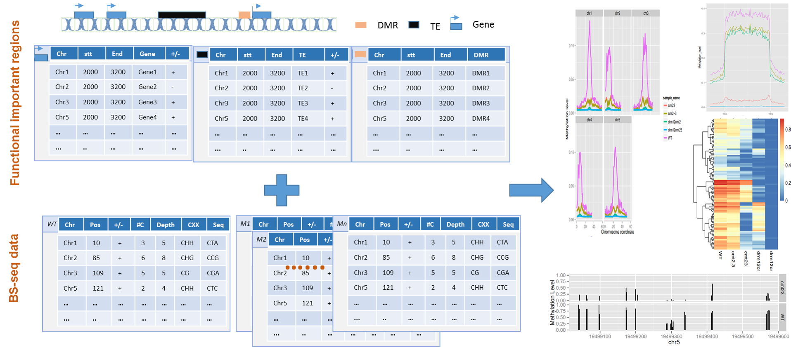
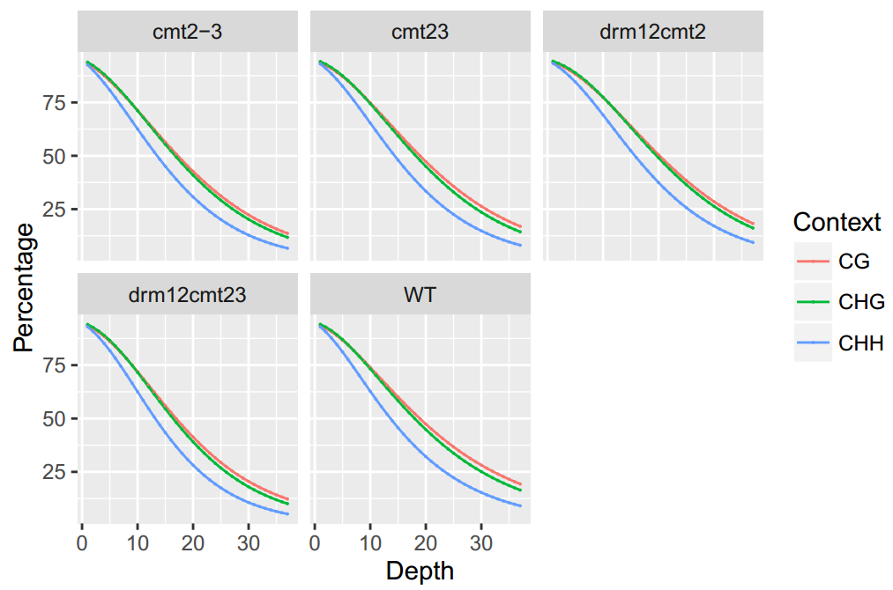
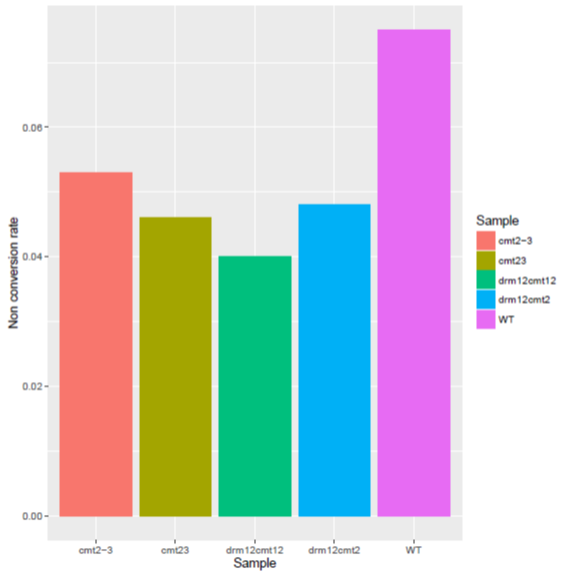
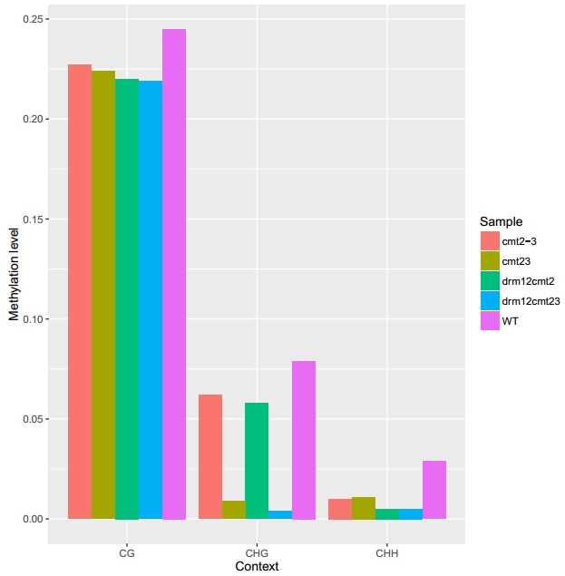
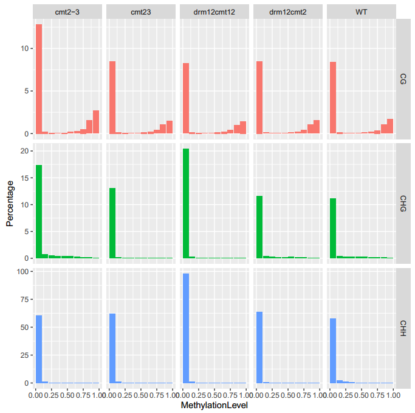
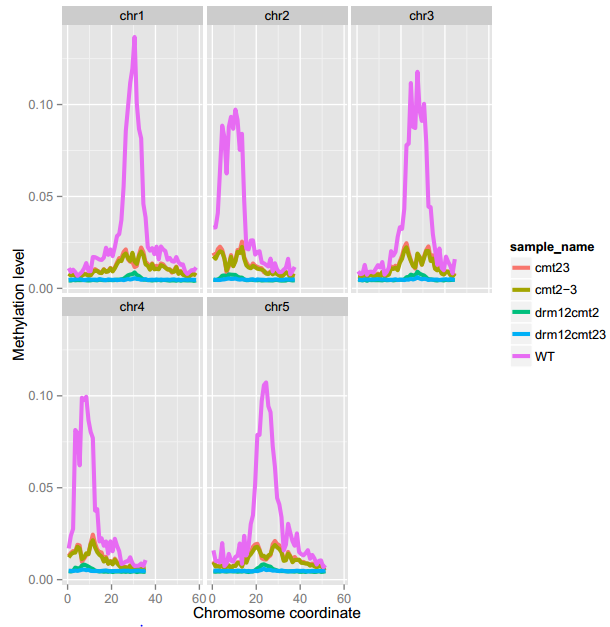
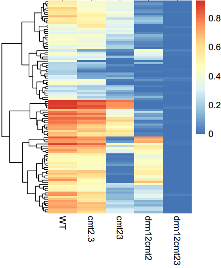
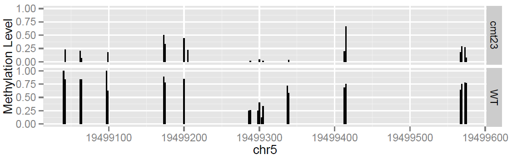

# ViewBS

## Where to find help

Recent changes, bug fixes and feature additions will be announced through this Google discussion group: [ViewBS discussion forum](https://groups.google.com/forum/#!forum/viewbs). Users are encouraged to ask questions through this forum (instead of shooting me emails) so that the answers can be shared. If you are interested, you can sign up to receive updates through E-mails.

##Installation

##### Requirements:
1. Install [htslib](https://github.com/samtools/htslib)
2. Perl version: >= 5.14.4
3. Perl packages:
   * Getopt::Long::Subcommand - Process command-line options, with subcommands and completion
   * Bio::DB::HTS::Tabix - Object oriented access to the underlying tbx C methods
   * Bio::SeqIO - Handler for SeqIO Formats
    ```
    wget https://raw.githubusercontent.com/miyagawa/cpanminus/master/cpanm
    chmod 755 cpanm
    ./cpanm Getopt::Long::Subcommand
    ./cpanm Bio::DB::HTS::Tabix
    ./cpanm Bio::SeqIO
    ```
4. R version: > 3.3.0
5. R packages
    * ggplot2
    * pheatmap
    * reshape2
    Install some required libraries in R:
    ```
    install.packages("ggplot2", dep=T)
    install.packages("pheatmap", dep=T)
    install.packages("reshape2", dep=T)
    ```
## Preparation of input files

* Input file: __Genome-wide cytosine methylation report__

ViewBS uses __Genome-wide cytosine methylation report__ as input file. It is sorted by chromosomal coordinates but also contains the sequence context and is in the following format:
```
<chromosome> <position> <strand> <count methylated> <count unmethylated> <C-context> <trinucleotide context>
```
Please see details in [Bismark](http://www.bioinformatics.babraham.ac.uk/projects/bismark/) websites.

> *Tips: how to generate __Genome-wide Cytosine Methylation Report__*

> If you already have finished the mapping using Bismark, you should have a sam/bam file. Let's say you have a sam file named *test.sam*. What you can do to generate __Genome-wide Cytosine Methylation Report__ is:

> ```
> ### This step will generate several files:
> bismark_methylation_extractor --bedGraph --CX test.sam
> ### This step will generate a file named bis_test.tab
> coverage2cytosine -CX -o test.bis_rep.cov --genome_folder ara/ test.bismark.cov
> ```
*If you have DNA methylation data generated by other tools and you have difficulties on converting the data format, just give a post in the Google Group. We're happy to add new functions for the file format conversion.*

* Tabix indexing 

Since ViewBS uses Bio::DB::HTS::Tabix to quickly retrieves information from the input (TAB-delited) files, the __Genome-wide Cytosine Methylation Report__ files should be *bgzip*ped and *tabix* indexed. *bgzip* and *tabix* . 

*Note: tabix and bgzip binaries are now part of the HTSlib project. https://github.com/samtools/htslib*

Here is an example:
```
bgzip test.bis_rep.cov            ## test.bis_rep.cov.gz will be generated. Note: test.bis_rep.cov shoud be sorted based on chromosome coordinates.
tabix -p vcf test.bis_rep.cov.gz  ## test.bis_rep.cov.gz.tbi will be generated. Now test.bis_rep.cov.gz can be used as input for ViewBS. 
```

## Work flow of ViewBS

ViewBS has several top level commands which determine the required and optimal arguments. These top level commands can be divided into two parts: methylation report and data visualization of functional regions. 

Methylation report part has several different top commands which can generate report about read coverage, distribution of methylation level, global methylation leve, etc.

The part of visualization for functional regions also has several different top commands. For ViewBS, the first input that users should provide is the regions of interest. These regions could be functional elements, like genes, transposable elements (TE), or differentially methylated regions (DMR). The other type of input that the users should provide is the methylation information. Methylation information are the outputs from BS-seq aligner, like Bismark, etc.

Here is the workflow of ViewBS:

<p align="center">
  
  <b>The workflow of ViewBS commands</b><br>
</p>

## USAGE

### Download test data

https://zenodo.org/record/58470#.V_UR-E0rJhE

### Top commands of ViewBS 

#### Top command: MethCoverage

<p align="center">
  
</p>
<p align="center">
  <b>An Example of Coverage Distribution of BS-seq</b><br>
</p>

To generate the figure above, use the command shown as below:
```
ViewBS MethCoverage --reference TAIR10_chr_all.fasta --sample bis_WT.tab.gz,WT --sample bis_cmt23.tab.gz,cmt23 --sample bis_cmt2-3.tab.gz,cmt2-3 --sample bis_drm12cmt23.tab.gz,drm12cmt12 --sample bis_drm12cmt2.tab.gz,drm12cmt2 --outdir methCoverage --prefix cmt2_proj_allsam
```
Under *methCoverage* folder, there will be three files generated.

* Table for global methylation level.

| Sample 	| Context  	| Depth 	| Percentage       	|
|--------	|----------	|-------	|------------------	|
| cmt2-3 	| CG       	| 1     	| 93.3323115145888 	|
| cmt2-3 	| CG       	| 2     	| 91.6474703919394 	|
| ...    	| ...      	| ...   	| ...              	|
| ...    	| ...      	| ...   	| ...              	|
| WT     	| CG       	| 1     	| 93.8364493009668 	|

* A shell script which can re-generate the figure in PDF file.
* A figure in PDF file.

#### Top command: BisNonConvRate

<p align="center">
  
</p>
<p align="center">
  <b>An Example of BisNonConvRate</b><br>
</p>

To generate the figure above, use the command shown as below:
```
ViewBS BisNonConvRate --chrom chrC --sample bis_WT.tab.gz,WT --sample bis_cmt23.tab.gz,cmt23 --sample bis_cmt2-3.tab.gz,cmt2-3 --sample bis_drm12cmt2.tab.gz,drm12cmt2 --sample bis_drm12cmt23.tab.gz,drm12cmt23 --outdir BisNonConvRate --prefix cmt2_proj_allsam
```
Under *BisNonConvRate*, there will be three files generated.

* Table for global methylation level.

| Sample     | BisNonConvRate |
|------------|----------------|
| cmt2-3     | 0.053          |
| drm12cmt2  | 0.048          |
| drm12cmt12 | 0.040          |
| cmt23      | 0.046          |
| WT         | 0.075          |

* A shell script which can re-generate the figure in PDF file.
* A figure in PDF file.

#### GlobalMethLev

<p align="center">
  
</p>
<p align="center">
  <b>An Example of GlobalMethLev</b><br>
</p>

To generate the figure above, use the command shown as below:
```
ViewBS GlobalMethLev --sample bis_WT.tab.gz,WT --sample bis_cmt23.tab.gz,cmt23 --sample bis_cmt2-3.tab.gz,cmt2-3 --sample bis_drm12cmt2.tab.gz,drm12cmt2 --sample bis_drm12cmt23.tab.gz,drm12cmt23 --outdir methGlobal --prefix cmt2_proj_allsam
```
Under *methGlobal*, there will be three files generated.

* Table for global methylation level.

| Sample     	| CG    	| CHG   	| CHH   	|
|------------	|-------	|-------	|-------	|
| cmt2-3     	| 0.227 	| 0.062 	| 0.010 	|
| drm12cmt2  	| 0.220 	| 0.058 	| 0.005 	|
| cmt23      	| 0.224 	| 0.009 	| 0.011 	|
| drm12cmt23 	| 0.219 	| 0.004 	| 0.005 	|
| WT         	| 0.245 	| 0.079 	| 0.029 	|

* A shell script which can re-generate the figure in PDF file.
* A figure in PDF file. 

#### MethLevDist

<p align="center">
  
</p>
<p align="center">
  <b>An Example of MethLevDist</b><br>
</p>

To generate the figure above, use the command shown as below:
```
ViewBS.pl MethLevDist --sample bis_WT.tab.gz,WT --sample bis_cmt23.tab.gz,cmt23 --sample bis_cmt2-3.tab.gz,cmt2-3 --sample bis_drm12cmt23.tab.gz,drm12cmt12 --sample bis_drm12cmt2.tab.gz,drm12cmt2 --outdir methLevDist --prefix cmt2_proj_allsam --binMethLev 0.1
```
* Table for numbers and percentages of sites in each methylation level bin.

| Sample 	| Context  	| MethLevBinMidPoint 	| Number   	| Percentage 	|
|--------	|----------	|------------------	|----------	|------------	|
| cmt2-3 	| CG       	| 0.05             	| 3305969  	| 12.83      	|
| cmt2-3 	| CG       	| 0.15             	| 62823    	| 0.24       	|
| cmt2-3 	| CG       	| 0.25             	| 25182    	| 0.09       	|
| ...    	| ...      	| ...              	| ...      	| ..         	|
| WT     	| CG       	| 0.05             	| 3470693  	| 13.73      	|

* A shell script which can re-generate the figure in PDF file.
* A figure in PDF file.

#### MethGeno

<p align="center">
  
</p>
<p align="center">
  <b>An example of MethGeno</b><br>
</p>

To generate the figure above, use the command shown as below:
```
ViewBS MethGeno --genomeLength TAIR10_chr_all.fasta.fai --sample bis_WT.tab.gz,WT --sample bis_cmt23.tab.gz,cmt23 --sample bis_cmt2-3.tab.gz,cmt2-3 --sample bis_drm12cmt2.tab.gz,drm12cmt2 --sample bis_drm12cmt23.tab.gz,drm12cmt23 --prefix bis_geno_sample --context CHH
```


#### View MethHeatmap

Region file format:
* 1st column: chromsome ID;
* 2nd column: start position;
* 3rd column: end position;
* 4th column: region ID

*Note: If the file has 4th column, each row in this column should be unique.* 

<p align="center">
  
</p>
<p align="center">
  <b>An example of MethHeatmap</b><br>
</p>

To generate the figure above, use the command shown as below:
```
ViewBS MethOverRegion --region TAIR10_Transposable_Elements.chr1.bed --sample bis_WT.tab.gz,WT --sample bis_cmt23.tab.gz,cmt23 --sample bis_cmt2-3.tab.gz,cmt2-3 --sample bis_drm12cmt2.tab.gz,drm12cmt2 --sample bis_drm12cmt23.tab.gz,drm12cmt23 --prefix bis_TE_chr1_sample --context CHG
```

#### MethOverRegion

<p align="center">
  
</p>
<p align="center">
  <b>An example of MethOverregion</b><br>
</p>

```
ViewBS MethOverRegion --region TAIR10_Transposable_Elements.chr1.bed --sample bis_WT.tab.gz,WT --sample bis_cmt23.tab.gz,cmt23 --sample bis_cmt2-3.tab.gz,cmt2-3 --sample bis_drm12cmt2.tab.gz,drm12cmt2 --sample bis_drm12cmt23.tab.gz,drm12cmt23 --prefix bis_TE_chr1_sample --context CHG
```

#### MethOneRegion

View MethOneRegion will output the methylation information for one region give by the users and then plot the methylation levels across the chromsomesome region. 

Here is an example:



To generate the figure above, you can use the following command line:
```
ViewBS MethOneRegion --region chr5:19499001-19499600 --sample bis_WT.tab.gz,WT --sample bis_cmt23.tab.gz,cmt23 --prefix chr5_19499001-19499600 --context CHG
```

##Appendix: Full list of options

#### 1) Top level commands

```
NAME
       ViewBS - Tools for exploring and visualizing deep sequencing of  bisulfite
        seuquencing (BS-seq) data.

VERSION
       0.2.0

SYNOPSIS

       ViewBS <subcmd> [options]

DESCRIPTION

       ViewBS is developped to mine and visualize bisulfite seuquencing data.

Options
       -help | -h
               Prints the help message and exits.

       Subcommands:
       MethGeno
                - Generate the methylation information across each chromosome and plot the information.

       MethRegion
                - Generate the methylation information across the regions provided here. The regions
                  can be genes, transposable elements, etc.

       MethHeatmap
               - Generate methylation information for a list of regions in different samples or contexts.

       MethMidpoint
                - Generate methylation information across the midpoints of a list of regions, like DMR.

HELP
               Here is the discussion group from google group: https://groups.google.com/forum/#!forum/viewbs

Denpendcies
       perl > v5.14.4
       Perl packages
                - Getopt::Long::Subcommand;
                - Bio::DB::HTS::Tabix;

       R  > v3.1.2
       R packages
                - ggplot2;
                - pheatmap

```

####

