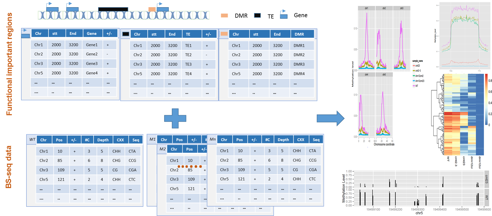
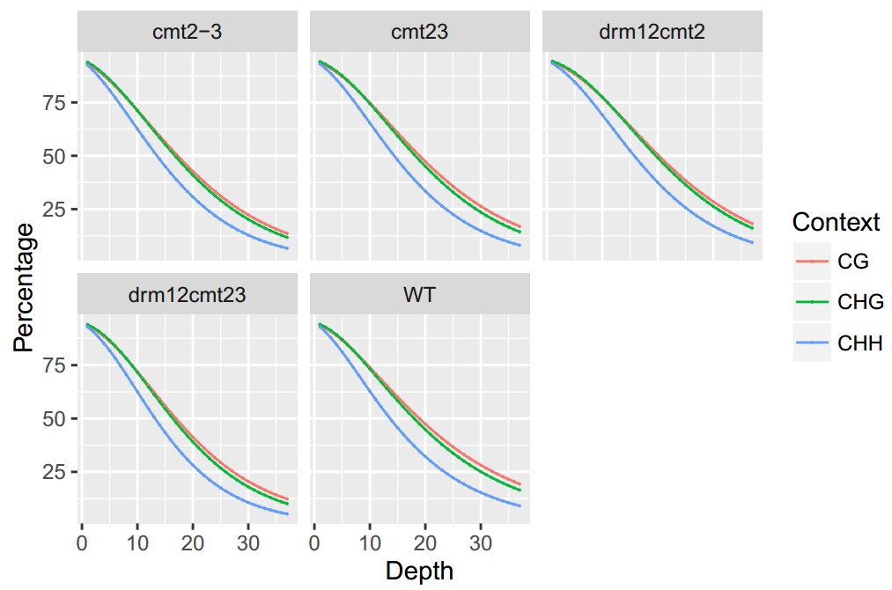
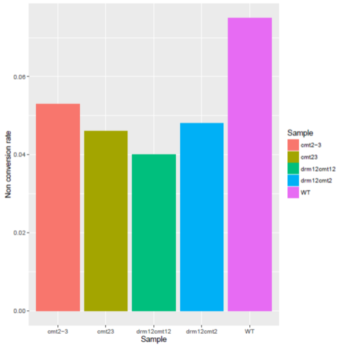
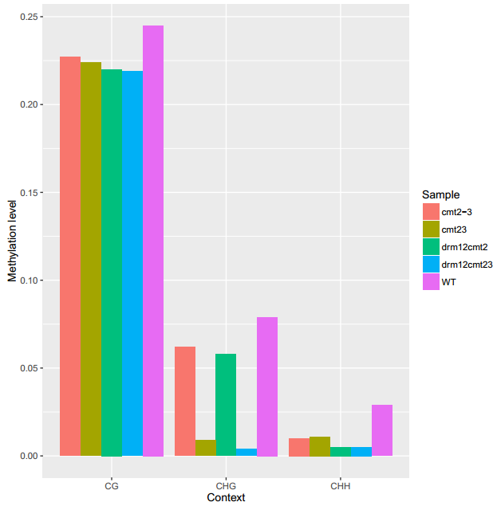
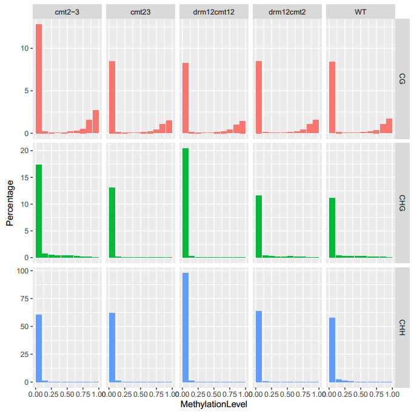
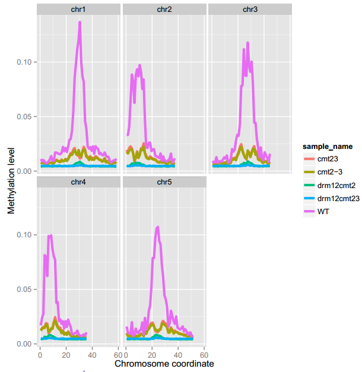
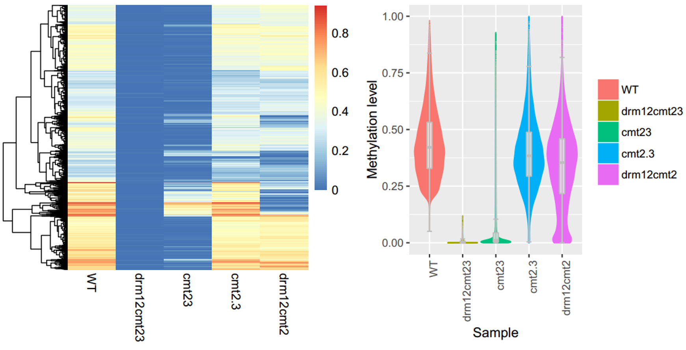
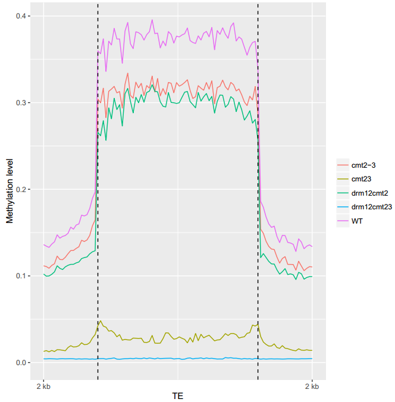
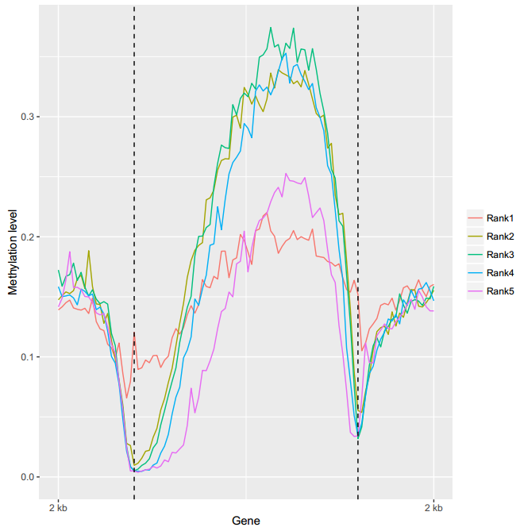
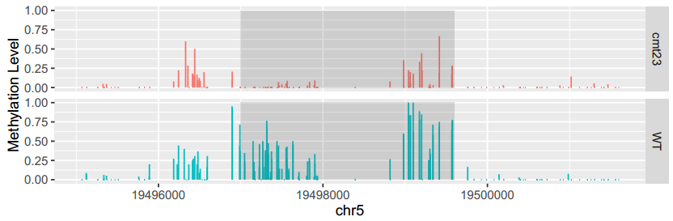

Table of Contents
=================

* [ViewBS](#viewbs)
  * [Workflow of ViewBS <a name="user\-content\-workflow"></a>](#workflow-of-viewbs-)
  * [Installation <a name="user\-content\-install"></a>](#installation-)
  * [Preparation of input files <a name="user\-content\-input"></a>](#preparation-of-input-files-)
  * [USAGE <a name="user\-content\-usage"></a>](#usage-)
    * [Download test data](#download-test-data)
	    * [Top commands of ViewBS](#top-commands-of-viewbs)
	      * [MethCoverage](#methcoverage)
	      * [BisNonConvRate](#bisnonconvrate)
	      * [GlobalMethLev](#globalmethlev)
	      * [MethLevDist](#methlevdist)
	      * [MethGeno](#methgeno)
	      * [View MethHeatmap](#view-methheatmap)
	      * [MethOverRegion](#methoverregion)
	      * [MethOneRegion](#methoneregion)
	    * [How to merge figures into one graph](#how-to-merge-figures-into-one-graph)
	    * [Rust rewrite migration notes](#rust-rewrite-migration-notes)
	      * [Legacy differences](#legacy-differences)
  * [Where to find help <a name="user\-content\-help"></a>](#where-to-find-help-)
  * [Commercial use](#commercial-use)
  * [How to cite <a name="user\-content\-cite"></a>](#how-to-cite-)
  * [Authors](#authors)

# ViewBS

## Workflow of ViewBS <a name="workflow"></a>

ViewBS has several top level commands which determine the required and optimal arguments. These top level commands can be divided into two parts: methylation report and data visualization of functional regions.

Methylation report part has several different top commands which can generate report about read coverage, distribution of methylation level, global methylation leve, etc.

The part of visualization for functional regions also has several different top commands. For ViewBS, the first input that users should provide is the regions of interest. These regions could be functional elements, like genes, transposable elements (TE), or differentially methylated regions (DMR). The other type of input that the users should provide is the methylation information. Methylation information are the outputs from BS-seq aligner, like Bismark, etc.

Here is the workflow of ViewBS:

<p align="center">
  
  <b>The workflow of ViewBS commands</b><br>
</p>


## Installation <a name="install"></a>

### Installation from release archives

Download the latest release:

```
https://github.com/xie186/ViewBS/releases/latest
```

Choose the archive for your operating system, unpack it, and put the `ViewBS` executable on your `PATH`.

The release archives are the primary distribution for the Rust version. The Rust release is a standalone command-line tool. It does not require R, Perl, htslib, or external plotting tools to run ViewBS commands or generate plots.

To build from source instead, install Rust and run:

```
cargo install --locked --path .
```

### Fallback package channels

Bioconda and Docker remain available for managed environments, shared clusters, and containerized workflows.

### Installation via `conda`

> Special thanks to [@xuzhougeng](https://github.com/xuzhougeng) for writing bioconda recipe for ViewBS (https://github.com/xie186/ViewBS/issues/57). 

#### Install `conda`

First you need to install miniconda following the instructions here: https://conda.io/en/latest/miniconda.html

#### Scenario 1

If you want to install `ViewBS` in an existing conda environment, please run:

```
conda activate <your_environment_name>
## If you want to install a specific verison, 
## replace 'viewbs' with 'viewbs=<version_number>' (e.g. 'viewbs=0.1.10')
conda install -c bioconda viewbs
```

#### Scenario 2

If you want to install `ViewBS` in a new conda environment, please run:

```
## You can change `env4viewbs` to other name you want
conda create -n env4viewbs -c bioconda viewbs
## To activate the environment
conda activate env4viewbs
```

### Installation with `Docker`

```
docker pull xie186/viewbs
## Use "docker run <image name>" ViewBS" to replace "ViewBS". Here is an example:
cd ViewBS_testdata/
docker run -v ${PWD}:/data -w /data bc1743f3418f ViewBS MethOneRegion --region chr5:19497000-19499600 --sample bis_WT.tab.gz,WT --sample bis_cmt23.tab.gz,cmt23 --outdir MethOneRegion --prefix chr5_19497000-19499600 --context CHG

## 1) ${PWD}:/data: means mount the current directory to /data in Docker image
## 2) bc1743f3418f: IMAGE ID (run `docker image ls` to get the IMAGE ID). 
```

> Because docker needs `root` access, sometimes it's not available. But `singularity` is an alternative software. Please see the link here for details: https://github.com/xie186/ViewBS/wiki/Run-ViewBS-with-%60Docker%60-or-%60Singularity%60#singularity

## Preparation of input files <a name="input"></a>

* Input file: __Genome-wide cytosine methylation report__

ViewBS uses __Genome-wide cytosine methylation report__ as input file. It is sorted by chromosomal coordinates but also contains the sequence context and is in the following format:
```
<chromosome> <position> <strand> <count methylated> <count unmethylated> <C-context> <trinucleotide context>
```
> NOTES: If you use other tools rather than Bismark to generate the methylation information, you can still use ViewBS. If you have a BAM file, for example one generated by [bwa-meth](https://github.com/brentp/bwa-meth), you can use [MethylDackel](https://github.com/dpryan79/MethylDackel) with `--cytosine_report` to output the methylation information in __Genome-wide cytosine methylation report__ format. ViewBS also provides Rust converter subcommands for several common input formats.


Please see details in [Bismark](http://www.bioinformatics.babraham.ac.uk/projects/bismark/) websites.

> *Tips: how to generate __Genome-wide Cytosine Methylation Report__*

> If you already have finished the mapping using Bismark, you should have a sam/bam file. Let's say you have a sam file named *test.sam*. What you can do to generate __Genome-wide Cytosine Methylation Report__ is:

> ```
> ### This step will generate several files:
> bismark_methylation_extractor --bedGraph --CX test.sam
> ### This step will generate a file named bis_test.tab
> coverage2cytosine -CX -o test.bis_rep.cov --genome_folder ara/ test.bismark.cov
> ```
*For BS-seq processed by tools such as [BRAT](http://compbio.cs.ucr.edu/brat/) or [BS seeker2](https://github.com/BSSeeker/BSseeker2), ViewBS can convert methylation data into the genome-wide cytosine methylation report format.*

Rust converter commands:

```
ViewBS convert bsseeker --input sample.CGmap --output sample.tab
ViewBS convert brat --input sample.brat --output sample.tab
ViewBS convert gff --input annotation.gff3 --output regions.tab
```

The legacy helper names are still accepted as compatibility aliases for existing workflows:

```
ViewBS bsseeker2bismark.pl --input sample.CGmap --output sample.tab
ViewBS brat2bismark.pl --input sample.brat --output sample.tab
ViewBS gff2tab.pl --input annotation.gff3 --output regions.tab
```

If you have DNA methylation data generated by other tools and have difficulty converting the data format, please open an issue at https://github.com/readbio/ViewBS/issues.

For details, please see the link below:
https://github.com/xie186/ViewBS/wiki/Support-for-nonBismark-results

* Tabix indexing

Region-query commands can read BGZF-compressed methylation reports with Tabix `.tbi` or CSI `.csi` indexes directly through the Rust binary. The __Genome-wide Cytosine Methylation Report__ files should be sorted by chromosome coordinate before indexing.

*Note: tabix and bgzip binaries are now part of the HTSlib project. https://github.com/samtools/htslib*

Here is an example:

```
bgzip test.bis_rep.cov            ## test.bis_rep.cov.gz will be generated. Note: test.bis_rep.cov shoud be sorted based on chromosome coordinates. 
tabix -C -p vcf test.bis_rep.cov.gz  ## test.bis_rep.cov.gz.csi will be generated. Now test.bis_rep.cov.gz can be used as input for ViewBS. 
## If there is no chromosome length beyond (2^29-1), you can also run: 
tabix -p vcf test.bis_rep.cov.gz  ## test.bis_rep.cov.gz.tbi will be generated. Now test.bis_rep.cov.gz can be used as input for ViewBS.
```

## USAGE <a name="usage"></a>

### Download test data

https://gitlab.com/BS-seq/ViewBS_testdata

### Top commands of ViewBS 

#### MethCoverage

<p align="center">
  
</p>
<p align="center">
  <b>An Example of Reverse Cumulative Plot with x-axis representing the coverage of BS-seq.</b><br>
</p>

To generate the figure above, use the command shown as below:
```
ViewBS MethCoverage --reference TAIR10_chr_all.fasta --sample bis_WT.tab.gz,WT --sample bis_cmt23.tab.gz,cmt23 --sample bis_cmt2-3.tab.gz,cmt2-3 --sample bis_drm12cmt23.tab.gz,drm12cmt12 --sample bis_drm12cmt2.tab.gz,drm12cmt2 --outdir methCoverage --prefix cmt2_proj_allsam
```
Under *methCoverage* folder, ViewBS writes table and plot outputs.

* Table for global methylation level.

| Sample 	| Context  	| Depth 	| Percentage       	|
|--------	|----------	|-------	|------------------	|
| cmt2-3 	| CG       	| 1     	| 93.3323115145888 	|
| cmt2-3 	| CG       	| 2     	| 91.6474703919394 	|
| ...    	| ...      	| ...   	| ...              	|
| ...    	| ...      	| ...   	| ...              	|
| WT     	| CG       	| 1     	| 93.8364493009668 	|

* Plot artifact generated directly by ViewBS (PDF by default; SVG/PNG via `--plot-format`).

#### BisNonConvRate

<p align="center">
  
</p>
<p align="center">
  <b>An Example of BisNonConvRate</b><br>
</p>

To generate the figure above, use the command shown as below:
```
ViewBS BisNonConvRate --chrom chrC --sample bis_WT.tab.gz,WT --sample bis_cmt23.tab.gz,cmt23 --sample bis_cmt2-3.tab.gz,cmt2-3 --sample bis_drm12cmt2.tab.gz,drm12cmt2 --sample bis_drm12cmt23.tab.gz,drm12cmt23 --outdir BisNonConvRate --prefix cmt2_proj_allsam
```
Under *BisNonConvRate*, ViewBS writes table and plot outputs.

* Table for global methylation level.

| Sample     | BisNonConvRate |
|------------|----------------|
| cmt2-3     | 0.053          |
| drm12cmt2  | 0.048          |
| drm12cmt12 | 0.040          |
| cmt23      | 0.046          |
| WT         | 0.075          |

* Plot artifact generated directly by ViewBS (PDF by default; SVG/PNG via `--plot-format`).

#### GlobalMethLev

<p align="center">
  
</p>
<p align="center">
  <b>An Example of GlobalMethLev</b><br>
</p>

To generate the figure above, use the command shown as below:
```
ViewBS GlobalMethLev --sample bis_WT.tab.gz,WT --sample bis_cmt23.tab.gz,cmt23 --sample bis_cmt2-3.tab.gz,cmt2-3 --sample bis_drm12cmt2.tab.gz,drm12cmt2 --sample bis_drm12cmt23.tab.gz,drm12cmt23 --outdir methGlobal --prefix cmt2_proj_allsam
```
Under *methGlobal*, ViewBS writes table and plot outputs.

* Table for global methylation level.

| Sample     	| CG    	| CHG   	| CHH   	|
|------------	|-------	|-------	|-------	|
| cmt2-3     	| 0.227 	| 0.062 	| 0.010 	|
| drm12cmt2  	| 0.220 	| 0.058 	| 0.005 	|
| cmt23      	| 0.224 	| 0.009 	| 0.011 	|
| drm12cmt23 	| 0.219 	| 0.004 	| 0.005 	|
| WT         	| 0.245 	| 0.079 	| 0.029 	|

* Plot artifact generated directly by ViewBS (PDF by default; SVG/PNG via `--plot-format`).

#### MethLevDist

<p align="center">
  
</p>
<p align="center">
  <b>An Example of MethLevDist</b><br>
</p>

To generate the figure above, use the command shown as below:
```
ViewBS MethLevDist --sample bis_WT.tab.gz,WT --sample bis_cmt23.tab.gz,cmt23 --sample bis_cmt2-3.tab.gz,cmt2-3 --sample bis_drm12cmt23.tab.gz,drm12cmt12 --sample bis_drm12cmt2.tab.gz,drm12cmt2 --outdir methLevDist --prefix cmt2_proj_allsam --binMethLev 0.1
```
* Table for numbers and percentages of sites in each methylation level bin.

| Sample 	| Context  	| MethLevBinMidPoint 	| Number   	| Percentage 	|
|--------	|----------	|------------------	|----------	|------------	|
| cmt2-3 	| CG       	| 0.05             	| 3305969  	| 12.83      	|
| cmt2-3 	| CG       	| 0.15             	| 62823    	| 0.24       	|
| cmt2-3 	| CG       	| 0.25             	| 25182    	| 0.09       	|
| ...    	| ...      	| ...              	| ...      	| ..         	|
| WT     	| CG       	| 0.05             	| 3470693  	| 13.73      	|

* Plot artifact generated directly by ViewBS (PDF by default; SVG/PNG via `--plot-format`).

#### MethGeno

<p align="center">
  
</p>
<p align="center">
  <b>An example of MethGeno</b><br>
</p>

To generate the figure above, use the command shown as below:
```
ViewBS MethGeno --genomeLength TAIR10_chr_all.fasta.fai --sample bis_WT.tab.gz,WT --sample bis_cmt23.tab.gz,cmt23 --sample bis_cmt2-3.tab.gz,cmt2-3 --sample bis_drm12cmt2.tab.gz,drm12cmt2 --sample bis_drm12cmt23.tab.gz,drm12cmt23 --prefix bis_geno_sample --context CHH
```

_Note: fai file can generated by samtools: ```samtools faidx TAIR10_chr_all.fasta```_

#### View MethHeatmap

Region file format:
* 1st column: chromsome ID;
* 2nd column: start position;
* 3rd column: end position;
* 4th column: region ID

*Note: If the file has 4th column, each row in this column should be unique.* 

<p align="center">
  
</p>
<p align="center">
  <b>An example of MethHeatmap</b><br>
</p>

To generate the figure above, use the command shown as below:
```
ViewBS MethHeatmap --region CHG_hypo_DMR_drm12cmt23_to_WT.txt --sample bis_WT.tab.gz,WT --sample bis_drm12cmt23.tab.gz,drm12cmt23 --sample bis_cmt23.tab.gz,cmt23 --sample bis_cmt2-3.tab.gz,cmt2-3 --sample bis_drm12cmt2.tab.gz,drm12cmt2 --prefix CHG_hypo_DMR_drm12cmt23_to_WT --context CHG --outdir MethHeatmap
```

#### MethOverRegion

<p align="center">
  
</p>
<p align="center">
  <b>An example of MethOverregion</b><br>
</p>

```
ViewBS MethOverRegion --region TAIR10_Transposable_Elements.chr1.bed --sample bis_WT.tab.gz,WT --sample bis_cmt23.tab.gz,cmt23 --sample bis_cmt2-3.tab.gz,cmt2-3 --sample bis_drm12cmt2.tab.gz,drm12cmt2 --sample bis_drm12cmt23.tab.gz,drm12cmt23 --prefix bis_TE_chr1_sample --context CHG
```

Besides providing sample and region information in the commind line, you can also read the information from a TEXT file. For example, if you are interested in more than one group of genes and you want to study the differences of DNA methylation patterns in the one sample, the methylation information can also be read from a TEXT file. Instead of giving an explicit sample information pairs, you need to write "file:" followed by the name of the TEXT file. In this case, you can only use --sample once and you cann't use --region anymore. 

The TEXT file should follow the following format:

|#MethReportFile | LegendName  | RegionFile   |
|----------------|-------------|--------------|
| DNAmethylation | RegionName1 | Region_file2 |

Here is an example:

```
ViewBS MethOverRegion --sample file:sampl_info_tab.txt --prefix bis_gene_5rank --context CG --outdir MethOverRegion
```

The genes were devided into quintiles based on gene expression level. Rank1 group was the group with lowest expression level. Users can use this method to study the correlation between DNA methylation and gene expression. 

| #DNAmethylationData 	| Region 	| RegionFile                     	|
|---------------------	|--------	|--------------------------------	|
| bis_WT.tab.gz       	| Rank1  	| TAIR10_GFF3_genes.WT.rank1.tab 	|
| bis_WT.tab.gz       	| Rank2  	| TAIR10_GFF3_genes.WT.rank2.tab 	|
| bis_WT.tab.gz       	| Rank3  	| TAIR10_GFF3_genes.WT.rank3.tab 	|
| bis_WT.tab.gz       	| Rank4  	| TAIR10_GFF3_genes.WT.rank4.tab 	|
| bis_WT.tab.gz       	| Rank5  	| TAIR10_GFF3_genes.WT.rank5.tab 	|

* Input format for the region file

1. Chromosome ID
2. Start postion
3. End position
4. ID
5. Strand ("+" or "-")

See an example here: https://gitlab.com/BS-seq/ViewBS_testdata/blob/master/testdata/TAIR10_Transposable_Elements.chr1.bed

Here is the figure generated by the command line above:



#### MethOneRegion

View MethOneRegion will output the methylation information for one region give by the users and then plot the methylation levels across the chromsomesome region. 

Here is an example:



To generate the figure above, you can use the following command line:

```
ViewBS MethOneRegion --region chr5:19499001-19499600 --sample bis_WT.tab.gz,WT --sample bis_cmt23.tab.gz,cmt23 --prefix chr5_19499001-19499600 --context CHG
```

### How to merge figures into one graph

The Rust version of ViewBS writes plot artifacts directly as PDF by default, with SVG and PNG available through `--plot-format`. ViewBS no longer writes `.rds` figure objects.

Use `ViewBS merge-figures` to combine existing SVG, PDF, or PNG plots into one output figure without R:

```
cd $PATH2testdata
ViewBS merge-figures \
  --input BisNonConvRate/cmt2_proj_allsam.pdf \
  --input MethGlobal/cmt2_proj_allsam.pdf \
  --input MethHeatmap/CHG_hypo_DMR_drm12cmt23_to_WT_MethHeatmap_CHG.pdf \
  --labels A,B,C \
  --output testplot_col2.pdf \
  --ncol 2 \
  --base-aspect-ratio 1.5
```

The same command can write SVG or PNG by choosing the extension in `--output`. SVG is the best reusable format when the combined figure will be edited later.

### Rust rewrite migration notes

Command names and input file formats are preserved where possible. Plot files replace the old serialized figure-object workflow:

- tables are still written as legacy `.tab` or `.txt` outputs;
- plots are written as PDF by default;
- use `--plot-format svg` or `--plot-format png` for alternate plot artifacts;
- `ViewBS merge-figures` replaces the old helper-script figure merge path;
- the standalone binary is pure Rust and runs without R, Perl, htslib, or external plotting tools.

### Legacy differences

Command names and input formats remain compatible where possible. The intentional differences in the Rust rewrite are:

- serialized `.rds` figure objects are no longer written;
- plot outputs are normal PDF, SVG, or PNG files generated directly by ViewBS;
- `ViewBS merge-figures` replaces the old R-based figure merge workflow;
- runtime dependencies on R, Perl, htslib, and external plotting tools were removed from the standalone binary;
- helper-script names such as `bsseeker2bismark.pl`, `brat2bismark.pl`, `gff2tab.pl`, and `mer_fig.R` are compatibility aliases for existing workflows, not separate Perl or R entry points.

Further improvement of the graph can be done in [Inkscape](https://inkscape.org/) if an SVG or PDF file was generated.

## Where to find help <a name="help"></a>

If you have bugs, feature requests, please report the issues here: (https://github.com/readbio/ViewBS/issues).

## Commercial use

ViewBS uses GNU GPLv3 and is free for use by academic users. If you want to use it in commercial settings, please contact us.

## How to cite <a name="cite"></a>

Xiaosan Huang, Shaoling Zhang, Kongqing Li, Jyothi Thimmapuram, Shaojun Xie; ViewBS: a powerful toolkit for visualization of high-throughput bisulfite sequencing data, Bioinformatics, , btx633, https://doi.org/10.1093/bioinformatics/btx633

## Authors

* Nanjing Agricultural University

Drs. Xiaosan Huang (huangxs@njau.edu.cn), Kong-Qing Li (likq@njau.edu.cn) and Shaoling Zhang (slzhang@njau.edu.cn).

* Purdue Univeristy

Drs. Shaojun Xie: (Email: xie186@purdue.edu)  and Jyothi Thimmapuram (jyothit@purdue.edu)
